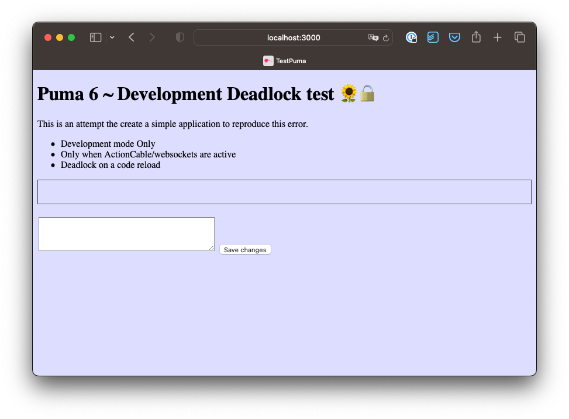
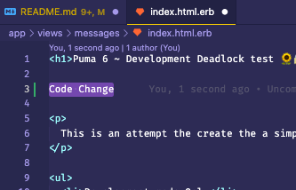

# README

This application demonstrates a deadlock in Puma 6, when having an active websockets connection in development mode.

This application is a standard rails 7 application, with minimal dependencies.
It uses Turbo to enable a simple actioncable/websocket connection.

This problems also occurs on Rails 6, with an active handmade ActionCable connection.

## Installation

Just download the repos and run bundle

```bash
bundle
```

## How to cause a deadlock

1. startup the server
   ```bash
   rails server
   ```
2. Open the app in a browser http://localhost:3000/

  

3. Refresh the page (Cmd+R)
4. No problems yet.
5. Do a code change in for example `app/views/messages/index.html.erb` and save the file

   

6. Refresh the page (Cmd+R)
7. The app hangs, usually the first time.


## Things I noticed

* This happens in several application that use an actioncable connection I have tested with Puma 6
* The code runs fine with Puma 5
* removing an active ActionCable/Websocket connection from the page will stop this bug. (I assume the deadlock occurs in the combination with ActionCable/Websockets). In this code example removing the `turbo_stream_from "messages"` line, solves it.
* The problem doesn't happen in production mode
* The problem happens when a code-reload takes place
* I also suspect this problem occurs when switching hostnames within the same application (I noticed this problem in a pretty complex multi-tentant App, which hangs when going to another hostname, even without code change)
